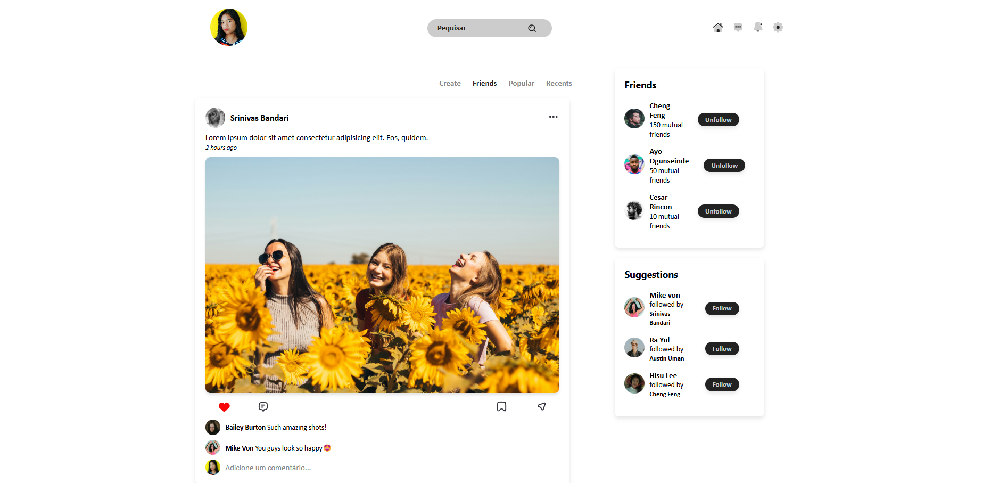
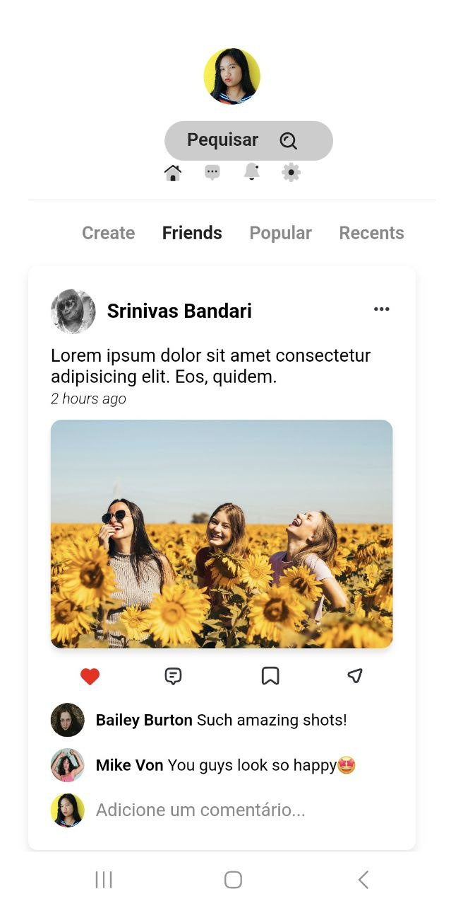
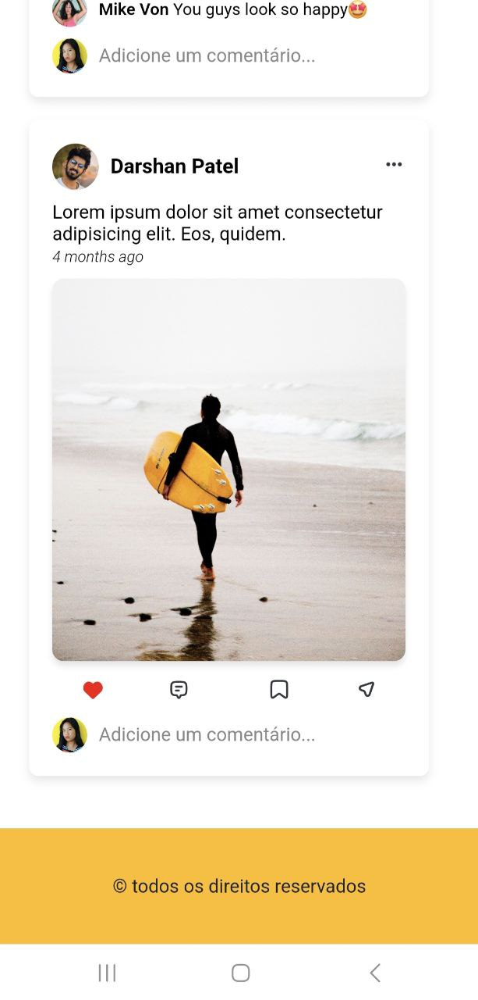

## Landing Page - Rede Social

Este é um projeto de landing page de rede social, desenvolvido utilizando HTML, CSS (com Grid e Flexbox) e recursos de layout responsivo. A página simula a interface de uma rede social com várias seções interativas, incluindo postagens de amigos, lista de amigos e sugestões de amizade.

### Funcionalidades

A página contém as seguintes seções:

- **Menu Principal**: Contém links para navegação.
- **Feed de Postagens de Amigos**: Mostra as postagens de amigos, com informações como imagem, título, texto, data de publicação, autor, curtidas, compartilhamentos e comentários.
- **Relação de Amigos**: Exibe uma lista de amigos, mostrando foto, nome e número de amigos em comum.
- **Relação de Sugestões de Amizade**: Apresenta sugestões de amizade com foto, nome e um amigo em comum.
- **Rodapé**: Um footer que ocupa toda a largura da página.

### Tecnologias Utilizadas

- **HTML5**: Estruturação do conteúdo.
- **CSS3**: Estilos para layout com uso de Grid Layout e Flexbox.
- **Flexbox**: Utilizado para elementos dentro de containers.
- **Grid Layout**: Usado para o layout principal da página.

### Screenshots do Site

<samp> site: https://itsleila.github.io/RedeSocialLandingpage/ </samp>
